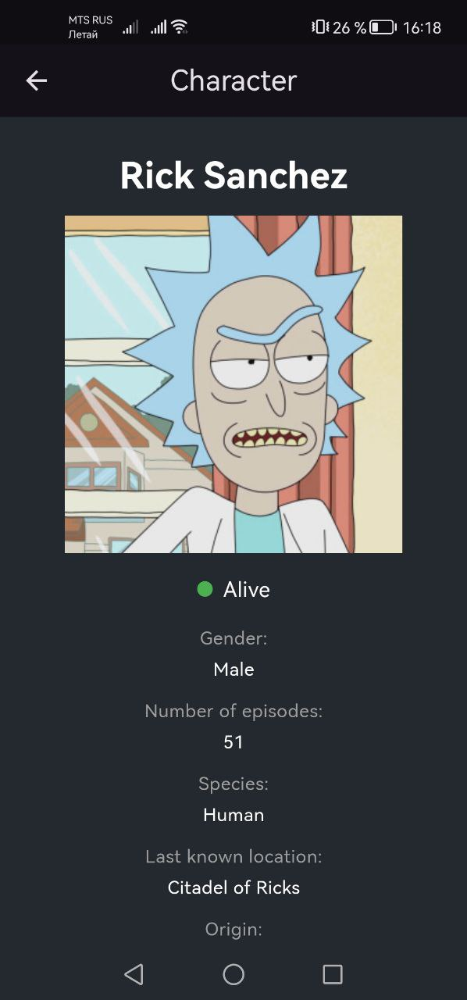

# Rick and Morty

Rick and Morty - это приложение на платформе Flutter, позволяющее смотреть американский анимационный телесериал "Рик и Морти" на английском языке с русскими или английскими субтитрами. Данное приложение помогает в изучении и практики английского языка.

 

### Screenshots

   

  
   
   
  	
  
   
  
  
  

   
  
## Версии SDK и пакетов

- Flutter: **3.24.0**
- Dart: **3.5.0**
- json_annotation: **^4.8.1**
- dartz: **^0.10.1**
- http: **^1.2.1**
- shared_preferences: **^2.2.3**
- internet_connection_checker: **^1.0.0+1**
- flutter_bloc: **^8.1.5**
- get_it: **^7.7.0**
- cached_network_image: **^3.3.1**
- freezed_annotation: **^2.4.1**
- pull_to_refresh: **^2.0.0**
- flutter_inappwebview: **^6.0.0**
- intl: **^0.19.0**

## Технологии и архитектурные подходы:

- BLoC / Cubit 
- Async programming 
- REST, JSON, HTTP
- Clean Architecture (Domain, Data and Presentation layers, SOLID, DI)
- TDD

 ## Изученные материалы

 - [Документация к The Rick and Morty API](https://rickandmortyapi.com/documentation)

## Demo

https://github.com/user-attachments/assets/779164cf-93fa-47b3-929d-3bfa486247e8

  

